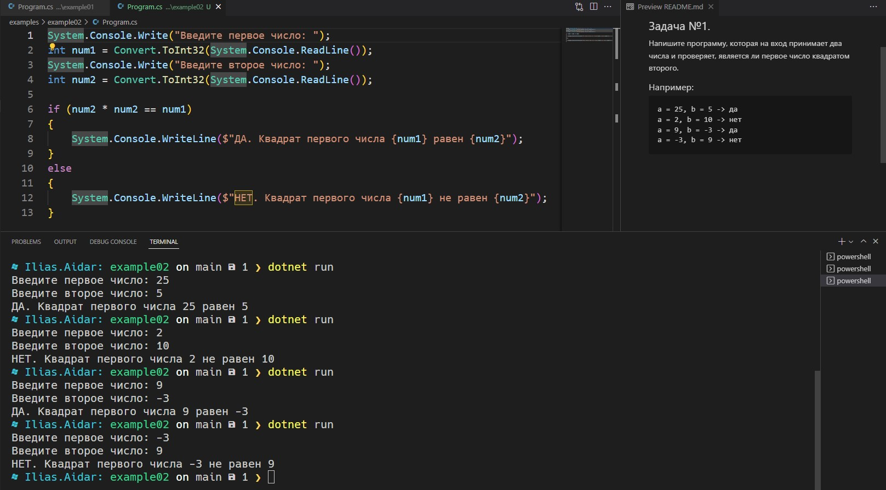

# Итерация №1 Общее обсуждение

## Задача №1.
Напишите программу, которая на вход принимает два числа и проверяет, является ли первое число квадратом второго.

### Например:
```
a = 25, b = 5 -> да
a = 2, b = 10 -> нет
a = 9, b = -3 -> да
a = -3, b = 9 -> нет
```

### Результат скриншотом
