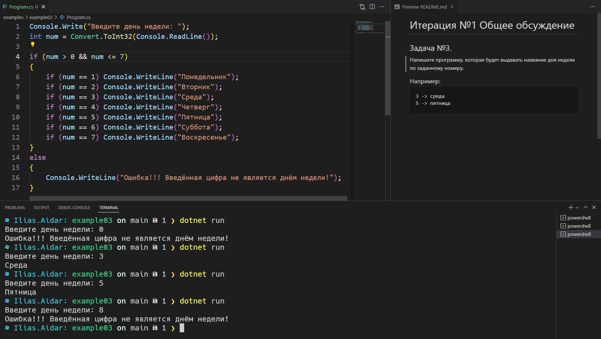

# Итерация №1 Общее обсуждение

## Задача №3.
Напишите программу, которая будет выдавать название дня недели по заданному номеру.

### Например:
```
3 -> среда
5 -> пятница
```

### Результат скриншотом
