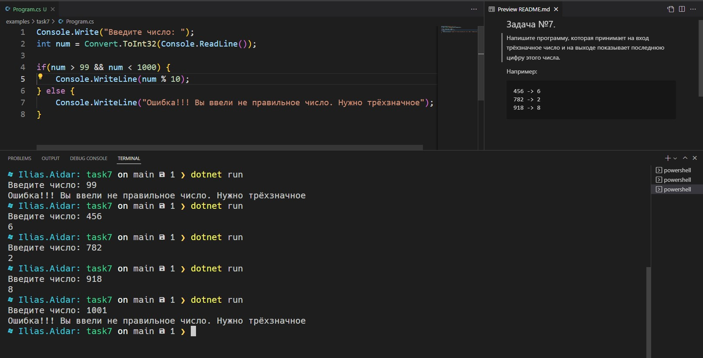

## Задача №7. 
Напишите программу, которая принимает на вход трёхзначное число и на выходе показывает последнюю цифру этого числа.

### Например:
```
456 -> 6
782 -> 2
918 -> 8
```

### Результат скриншотом
