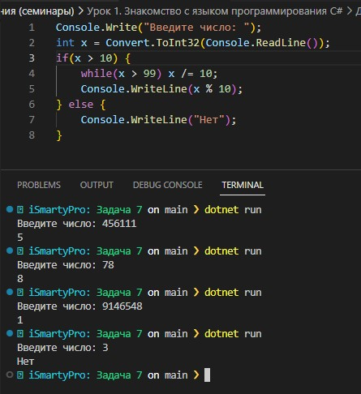

### Задача 7 HARD по желанию - идет за 2 необязательных Напишите программу, которая принимает на вход целое число любой разрядности и на выходе показывает вторую цифру слева этого числа или говорит, что такой цифры нет. Через строку решать нельзя.
```
456111 -> 5
78 -> 8
9146548 -> 1
3 -> нет
```
### Результат скриншотом
