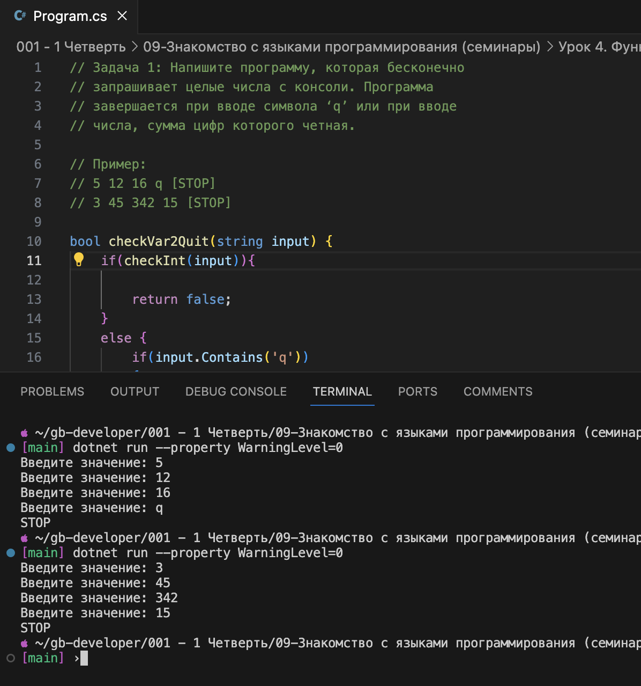
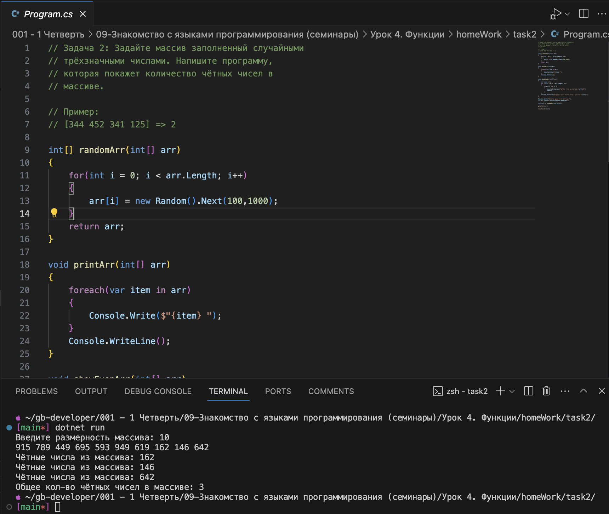
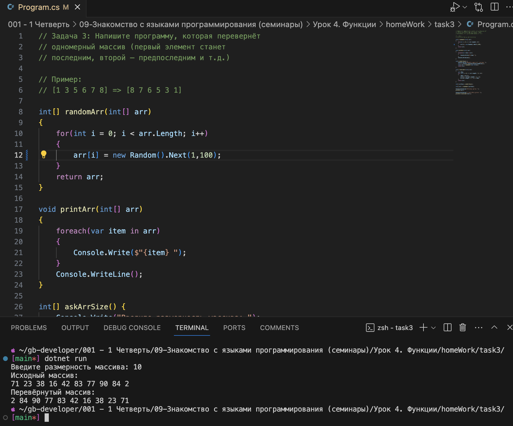

# Урок 4. Функции. Домашние задание

## Задача 1: 
```
Напишите программу, которая бесконечно
запрашивает целые числа с консоли. Программа
завершается при вводе символа ‘q’ или при вводе
числа, сумма цифр которого четная.

Пример:
5 12 16 q [STOP]
3 45 342 15 [STOP]
```

[Исходный код](./task1/)

#### Скрншот результата


## Задача 2
```
Задайте массив заполненный случайными
трёхзначными числами. Напишите программу,
которая покажет количество чётных чисел в
массиве.

Пример:
[344 452 341 125] => 2
```

[Исходный код](./task2/)

#### Скрншот результата


## Задача 3
```
Напишите программу, которая перевернёт
одномерный массив (первый элемент станет
последним, второй – предпоследним и т.д.)

Пример:
[1 3 5 6 7 8] => [8 7 6 5 3 1]
```

[Исходный код](./task3/)

#### Скрншот результата

