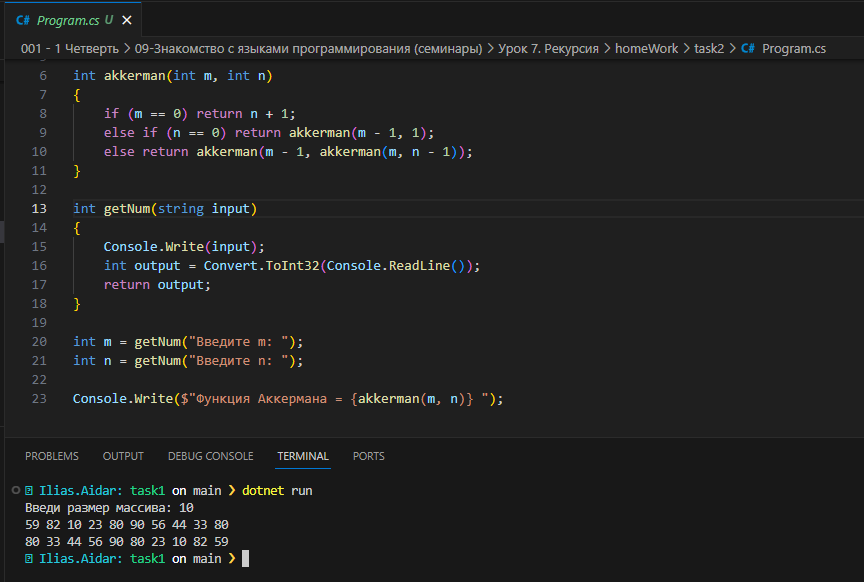
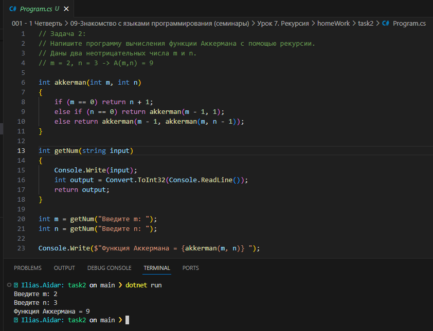
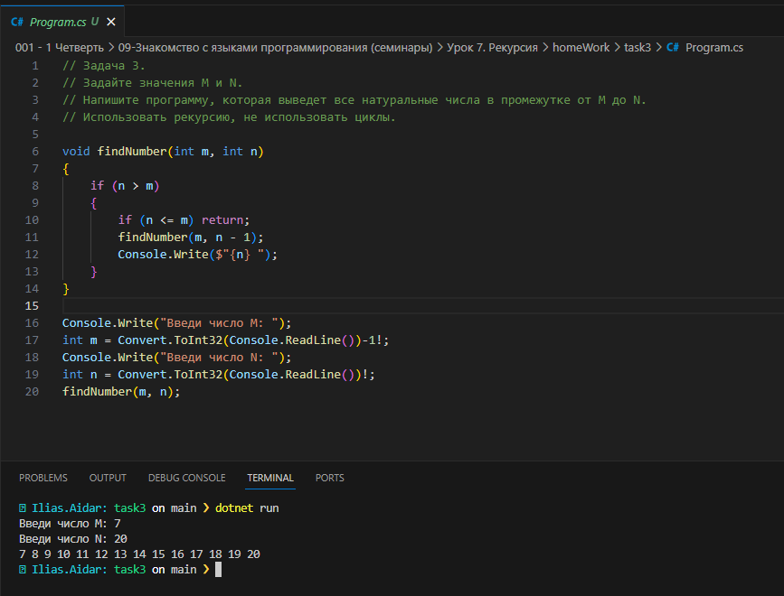

# Урок 7. Рекурсия

### Задача 1: 

Задайте значения M и N. Напишите программу, которая выведет все натуральные числа в промежутке от M до N. Использовать рекурсию, не использовать циклы.

[Исходник](./task1/)

### Задача 2: 

Напишите программу вычисления функции Аккермана с помощью рекурсии. Даны два неотрицательных числа m и n.

[Исходник](./task2/)

### Задача 3: 

Задайте произвольный массив. Выведете его элементы, начиная с конца. Использовать рекурсию, не использовать циклы.

[Исходник](./task3/)

*Пример вы найдете в конце презентации к семинару.*